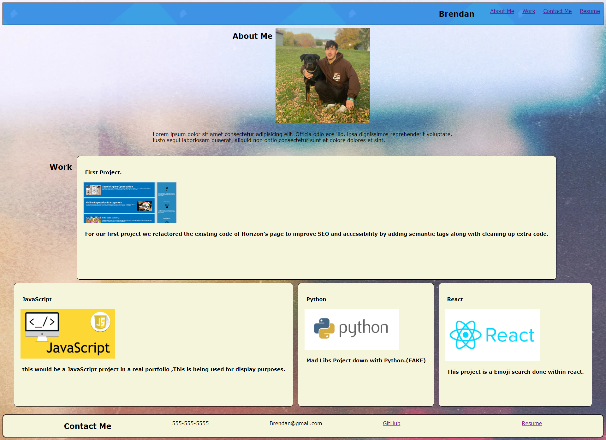

# Portfolio Mock Resume

## Description
This is a Mock resume made for display purposes to show a would be employer a candidents relevant information, along with projects showcased with links to respective projects deplaoyed page.

## Credits
Here are a few links that helped me build this project!
#
### Really helped with better understanding FlexBox:
A Complete Guide To Flexbox- https://css-tricks.com/snippets/css/a-guide-to-flexbox/

### For all the placeholder project images were found and pulled from Google:
Google- https://www.google.com/

## Project Links

<!-- 
Here is a link to the project shown above : file:///C:/Users/breke/Documents/bootcamp/homework/02-Challenge/index.html -->

## Test
 -within the projects header you can click on the navs that will bring you to the corresponding section.

 -within the project there are also links to my GitHub page and first project when clicked on the project image.